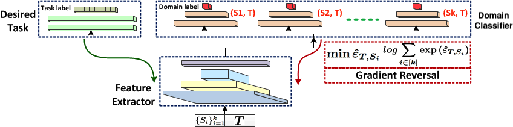

# MDAN: Multiple Source Domain Adaptation with Adversarial Learning

PyTorch demo code for paper [Multiple Source Domain Adaptation with Adversarial Learning](https://openreview.net/pdf?id=ryDNZZZAW) and [Adversarial Multiple Source Domain Adaptation](https://papers.nips.cc/paper/8075-adversarial-multiple-source-domain-adaptation.pdf) by [Han Zhao](http://www.cs.cmu.edu/~hzhao1/), [Shanghang Zhang](https://scholar.google.com/citations?user=voqw10cAAAAJ&hl=en), [Guanhang Wu](https://scholar.google.com/citations?user=0pF6i38AAAAJ&hl=en), [João Costeira](http://users.isr.ist.utl.pt/~jpc/), [José Moura](http://users.ece.cmu.edu/~moura/) and [Geoff Gordon](http://www.cs.cmu.edu/~ggordon/). 

## Summary

MDAN is a method for domain adaptation with multiple sources. Specifically, during training, a set of $k$ domains, represented by $k$ labeled source datasets, together with one unlabeled target dataset, are used to train the model jointly. A schematic representation of the overall model during the training phase is shown in the following figure:



Essentially, MDAN contains three components:

*   A feature extractor, parametrized by a neural network.
*   A hypothesis, classifier/regressor, for the desired task.
*   A set of $k$ domain classifier, where each corresponds to a binary classifier that tries to discriminate between the pair $(S_i, T)$.

At a high level, in each iteration:

1.  Feature extractor + hypothesis try to learn informative representation and decision boundary that have good generalization on the $k$ source tasks (because we have label).
2.  Feature extractor + domain classifiers form a two-player zero-sum game, where the feature extractor tries to learn domain invariant representation and the domain classifier tries to distinguish whether the given sample is from source domain or target domain. Note that each domain classifier is only responsible for one specific domain classification task, i.e., for the pair $(S_i, T)$.

Since we have $k$ domain classifiers, to define an overall reward for the set of $k$ domain classifiers, we develop two variants of MDAN:

*   Hard-Max MDAN:  The overall reward/error is defined to be the minimum classification error rate (Left part of the red box in the above figure).
*   Soft-Max MDAN:  The overall reward/error is defined to be the $\log\sum\exp(\cdot)$ of all the $k$ domain classification errors (Right part of the red box in the figure).

More detailed description about these two variants could be found in Section 4 of the paper [Adversarial Multiple Source Domain Adaptation](https://papers.nips.cc/paper/8075-adversarial-multiple-source-domain-adaptation.pdf). 

## Optimization

It is notoriously hard to optimize minimax problem when it is nonconvex. Our goal is to converge to a saddle point. In this code repo we use the double gradient descent method, e.g., the primal-dual gradient method, to optimize the objective function. Intuitively, this means that we use simultaneous gradient updates for all the components in the model. As a comparison, in block coordinate method, we would either fix the set of $k$ domain classifiers or the feature extractor and the hypothesis, and optimize the other until convergence, and then iterate from there. 

Specifically, we use the well-known *[gradient reversal layer](https://arxiv.org/abs/1409.7495)* to implement this method. Code snippet in PyTorch shown as follows:

```python
class GradientReversalLayer(torch.autograd.Function):
    """
    Implement the gradient reversal layer for the convenience of domain adaptation neural network.
    The forward part is the identity function while the backward part is the negative function.
    """
    def forward(self, inputs):
        return inputs

    def backward(self, grad_output):
        grad_input = grad_output.clone()
        grad_input = -grad_input
        return grad_input
```

## Prerequisites

*   `Python 3.6.6`
*   `PyTorch >= 1.0.0`
*   `Numpy`
*   `Scipy`

__________

This part explains how to reproduce the *Amazon sentiment analysis* experiment in the paper. 

### Training + Evaluation

Run
```python
python main_amazon.py -o [maxmin|dynamic]
```
Here `maxmin` corresponds to the Hard-Max variant and `dynamic` corresponds to the Soft-Max variant. 

Several practical suggestions on training these models:

*   The adaptation performance depends on the `--mu` hyperparameter that corresponds to the coefficient for the domain adversarial loss. This hyperparameter is dataset dependent and should be chosen appropriately for different datasets. 
*   One may not want to set the number of training epochs to be too large. Theoretically, this could hurt the adaptation performance when the label distributions between source domain and target domain are significantly different. This phenomenon is observed in practice and further explained in our recent paper [On Learning Invariant Representation for Domain Adaptation
](https://arxiv.org/abs/1901.09453). 

## Citation
If you use this code for your research and find it helpful, please cite our paper [Multiple Source Domain Adaptation with Adversarial Learning](https://openreview.net/pdf?id=ryDNZZZAW) or [Adversarial Multiple Source Domain Adaptation](https://papers.nips.cc/paper/8075-adversarial-multiple-source-domain-adaptation.pdf):
```
@article{zhao2018multiple,
  title={Multiple source domain adaptation with adversarial learning},
  author={Zhao, Han and Zhang, Shanghang and Wu, Guanhang and Moura, Jos{\'e} MF and Costeira, Joao P and Gordon, Geoffrey J},
  booktitle={International Conference on Learning Representations, workshop track},
  year={2018}
}
```
or
```
@inproceedings{zhao2018adversarial,
  title={Adversarial multiple source domain adaptation},
  author={Zhao, Han and Zhang, Shanghang and Wu, Guanhang and Moura, Jos{\'e} MF and Costeira, Joao P and Gordon, Geoffrey J},
  booktitle={Advances in Neural Information Processing Systems},
  pages={8568--8579},
  year={2018}
}
```

## Contact
Please email to [han.zhao@cs.cmu.edu](mailto:han.zhao@cs.cmu.edu) should you have any questions, comments or suggestions.
